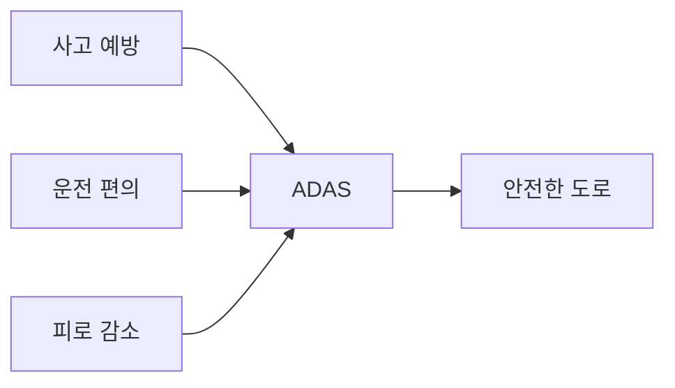
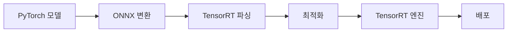

# 🚗 ADAS 완벽 가이드: TensorRT vs PyTorch
### 첨단 운전자 보조 시스템의 모든 것

[](https://en.wikipedia.org/wiki/Advanced_driver-assistance_systems)
[](https://pytorch.org/)
[](https://developer.nvidia.com/tensorrt)
[](LICENSE)

> 🎯 **이 가이드의 목표**: ADAS 기술을 이해하고, PyTorch로 모델을 개발한 후 TensorRT로 최적화하여 실제 차량에 배포하는 전체 과정을 배웁니다.

---

## 📚 목차

1. [ADAS란 무엇인가?](#-adas란-무엇인가)
2. [ADAS 주요 기능 상세 설명](#-adas-주요-기능-상세-설명)
3. [ADAS 모델 개발 흐름](#-adas-모델-개발-흐름)
4. [TensorRT vs PyTorch 완벽 비교](#-tensorrt-vs-pytorch-완벽-비교)
5. [실습: PyTorch에서 TensorRT로](#-실습-pytorch에서-tensorrt로)
6. [성능 최적화 팁](#-성능-최적화-팁)
7. [실제 차량 배포 가이드](#-실제-차량-배포-가이드)
8. [용어집](#-용어집)
9. [추가 학습 자료](#-추가-학습-자료)

---

## 🚘 ADAS란 무엇인가?

### 📖 쉬운 정의

**ADAS (Advanced Driver Assistance Systems)**는 운전을 더 안전하고 편리하게 만들어주는 "스마트 도우미"입니다.

**일상 비유**: 
- ADAS는 운전할 때 옆에서 도와주는 **"경험 많은 조수석 친구"** 같습니다
- 위험을 미리 알려주고 ⚠️
- 실수를 바로잡아주고 ✅
- 긴 운전에서 피로를 덜어줍니다 😊

### 🎯 ADAS의 핵심 목표



### 🔄 ADAS 작동 원리

```python
# ADAS 시스템의 기본 흐름
class ADASSystem:
    def __init__(self):
        self.sensors = ["카메라", "레이더", "라이다", "초음파"]
        self.processors = ["AI 모델", "신호 처리"]
        self.actuators = ["브레이크", "조향", "가속"]
    
    def process(self):
        """ADAS 처리 과정"""
        # 1. 감지: 주변 환경 인식
        environment = self.sense_environment()
        
        # 2. 판단: AI가 상황 분석
        decision = self.analyze_situation(environment)
        
        # 3. 행동: 차량 제어
        self.execute_action(decision)
        
        return "안전 운전 보조 중 ✅"
```

---

## 🛡️ ADAS 주요 기능 상세 설명

### 1. 🚦 ACC (Adaptive Cruise Control) - 적응형 크루즈 컨트롤

**작동 원리**: 앞차와의 거리를 자동으로 유지하며 속도 조절

```python
def adaptive_cruise_control(current_speed, front_car_distance, set_speed):
    """ACC 시스템 로직"""
    SAFE_DISTANCE = 50  # 미터
    
    if front_car_distance < SAFE_DISTANCE:
        # 앞차가 가까우면 감속
        return "감속 🔽"
    elif current_speed < set_speed and front_car_distance > SAFE_DISTANCE:
        # 안전거리 확보 & 설정 속도보다 느리면 가속
        return "가속 🔼"
    else:
        return "속도 유지 ➡️"

# 실제 상황 예시
print(adaptive_cruise_control(80, 30, 100))  # 출력: 감속 🔽
print(adaptive_cruise_control(80, 70, 100))  # 출력: 가속 🔼
```

### 2. 🛣️ LKA (Lane Keeping Assist) - 차선 유지 보조

**작동 원리**: 차선 이탈 감지 시 자동으로 조향 보정

```python
class LaneKeepingAssist:
    def __init__(self):
        self.camera = "전방 카메라"
        self.warning_threshold = 0.3  # 30cm
        self.correction_threshold = 0.5  # 50cm
    
    def detect_lane_departure(self, image):
        """차선 이탈 감지"""
        # 실제로는 컴퓨터 비전 알고리즘 사용
        left_line, right_line = self.detect_lane_lines(image)
        car_center = self.get_car_center()
        
        # 차선 중앙으로부터의 거리 계산
        offset = self.calculate_offset(car_center, left_line, right_line)
        
        if abs(offset) > self.correction_threshold:
            return "조향 보정 필요", offset
        elif abs(offset) > self.warning_threshold:
            return "경고", offset
        else:
            return "정상", offset
    
    def detect_lane_lines(self, image):
        """딥러닝 모델로 차선 검출"""
        # PyTorch 모델 사용
        lanes = self.lane_detection_model(image)
        return lanes['left'], lanes['right']
```

### 3. 🚨 AEB (Autonomous Emergency Braking) - 자동 긴급 제동

**작동 원리**: 충돌 위험 감지 시 자동으로 브레이크 작동

```python
class AutoEmergencyBraking:
    def __init__(self):
        self.radar = "전방 레이더"
        self.camera = "전방 카메라"
        
    def calculate_time_to_collision(self, distance, relative_speed):
        """충돌까지 남은 시간 계산"""
        if relative_speed <= 0:
            return float('inf')  # 충돌 위험 없음
        
        ttc = distance / relative_speed
        return ttc
    
    def decide_action(self, ttc):
        """TTC에 따른 행동 결정"""
        if ttc < 0.6:
            return "🚨 긴급 제동! (100% 브레이크)"
        elif ttc < 1.5:
            return "⚠️ 부분 제동 (50% 브레이크)"
        elif ttc < 3.0:
            return "📢 경고음 발생"
        else:
            return "✅ 안전"
    
    def process(self, sensor_data):
        """AEB 처리 과정"""
        # 1. 장애물 감지
        obstacle = sensor_data['obstacle']
        distance = obstacle['distance']
        relative_speed = obstacle['relative_speed']
        
        # 2. TTC 계산
        ttc = self.calculate_time_to_collision(distance, relative_speed)
        
        # 3. 행동 결정
        action = self.decide_action(ttc)
        
        print(f"거리: {distance}m, 상대속도: {relative_speed}m/s")
        print(f"충돌까지: {ttc:.1f}초")
        print(f"조치: {action}")
        
        return action

# 시뮬레이션
aeb = AutoEmergencyBraking()
sensor_data = {
    'obstacle': {
        'distance': 10,  # 10미터 앞
        'relative_speed': 20  # 20m/s로 접근 중
    }
}
aeb.process(sensor_data)
# 출력: 충돌까지: 0.5초, 조치: 🚨 긴급 제동!
```

### 4. 📐 BSD (Blind Spot Detection) - 사각지대 감지

```python
class BlindSpotDetection:
    def __init__(self):
        self.side_radars = ["좌측 레이더", "우측 레이더"]
        self.warning_zones = {
            'left': {'x': (-4, -1), 'y': (-2, 0)},   # 좌측 사각지대
            'right': {'x': (-4, -1), 'y': (0, 2)}    # 우측 사각지대
        }
    
    def check_blind_spots(self, radar_data):
        """사각지대 차량 확인"""
        warnings = []
        
        for side in ['left', 'right']:
            if self.is_vehicle_in_zone(radar_data[side], self.warning_zones[side]):
                warnings.append(f"{side} 사각지대 차량 감지! ⚠️")
                # 사이드미러 LED 경고등 켜기
                self.activate_mirror_warning(side)
        
        return warnings
```

### 5. 🅿️ APA (Automatic Parking Assist) - 자동 주차 보조

```python
class AutoParkingAssist:
    def __init__(self):
        self.ultrasonic_sensors = 12  # 전방위 초음파 센서
        self.min_space_parallel = 6.0  # 평행주차 최소 공간 (미터)
        self.min_space_perpendicular = 2.5  # 직각주차 최소 공간
    
    def find_parking_space(self, sensor_data):
        """주차 공간 탐색"""
        spaces = []
        
        for i, reading in enumerate(sensor_data):
            if reading['distance'] > self.min_space_parallel:
                spaces.append({
                    'type': 'parallel',
                    'size': reading['distance'],
                    'position': i
                })
        
        return spaces
    
    def execute_parking(self, space_info):
        """자동 주차 실행"""
        steps = []
        
        if space_info['type'] == 'parallel':
            steps = [
                "1. 주차공간 옆 정렬 🚗",
                "2. 후진 기어 (R) 🔄",
                "3. 핸들 우측 최대 ↪️",
                "4. 45도 각도까지 후진 📐",
                "5. 핸들 반대로 ↩️",
                "6. 정렬 완료까지 후진 ✅",
                "7. 위치 미세조정 🎯"
            ]
        
        for step in steps:
            print(step)
            # 실제로는 각 단계별 차량 제어 명령 실행
        
        return "주차 완료! 🎉"
```

---

## 🔧 ADAS 모델 개발 흐름

### 📊 전체 개발 파이프라인


### 1️⃣ 데이터 수집 및 라벨링

```python
import torch
import torchvision
from torch.utils.data import Dataset, DataLoader
import cv2
import json

class ADASDataset(Dataset):
    """ADAS 학습용 데이터셋"""
    
    def __init__(self, data_dir, annotations_file, transform=None):
        self.data_dir = data_dir
        self.transform = transform
        
        # 주석 파일 로드 (COCO 형식)
        with open(annotations_file, 'r') as f:
            self.annotations = json.load(f)
        
        self.classes = {
            0: 'background',
            1: 'car',
            2: 'pedestrian',
            3: 'cyclist',
            4: 'traffic_light',
            5: 'traffic_sign',
            6: 'lane_line'
        }
    
    def __len__(self):
        return len(self.annotations['images'])
    
    def __getitem__(self, idx):
        # 이미지 로드
        img_info = self.annotations['images'][idx]
        image_path = f"{self.data_dir}/{img_info['file_name']}"
        image = cv2.imread(image_path)
        image = cv2.cvtColor(image, cv2.COLOR_BGR2RGB)
        
        # 라벨 가져오기
        annotations = [ann for ann in self.annotations['annotations'] 
                      if ann['image_id'] == img_info['id']]
        
        # 바운딩 박스와 클래스 추출
        boxes = []
        labels = []
        
        for ann in annotations:
            boxes.append(ann['bbox'])  # [x, y, width, height]
            labels.append(ann['category_id'])
        
        # 텐서로 변환
        boxes = torch.as_tensor(boxes, dtype=torch.float32)
        labels = torch.as_tensor(labels, dtype=torch.int64)
        
        target = {
            'boxes': boxes,
            'labels': labels,
            'image_id': torch.tensor([idx])
        }
        
        if self.transform:
            image = self.transform(image)
        
        return image, target

# 데이터 로더 생성
def create_data_loaders(batch_size=8):
    """학습용 데이터 로더 생성"""
    
    transform = torchvision.transforms.Compose([
        torchvision.transforms.ToTensor(),
        torchvision.transforms.Normalize(
            mean=[0.485, 0.456, 0.406],
            std=[0.229, 0.224, 0.225]
        )
    ])
    
    # 데이터셋 생성
    train_dataset = ADASDataset(
        data_dir='data/train',
        annotations_file='data/train_annotations.json',
        transform=transform
    )
    
    val_dataset = ADASDataset(
        data_dir='data/val',
        annotations_file='data/val_annotations.json',
        transform=transform
    )
    
    # 데이터 로더
    train_loader = DataLoader(
        train_dataset,
        batch_size=batch_size,
        shuffle=True,
        num_workers=4,
        collate_fn=lambda x: tuple(zip(*x))
    )
    
    val_loader = DataLoader(
        val_dataset,
        batch_size=batch_size,
        shuffle=False,
        num_workers=4,
        collate_fn=lambda x: tuple(zip(*x))
    )
    
    return train_loader, val_loader
```

### 2️⃣ PyTorch 모델 학습

```python
import torch
import torch.nn as nn
import torchvision.models as models
from torchvision.models.detection import fasterrcnn_resnet50_fpn
from torchvision.models.detection.faster_rcnn import FastRCNNPredictor

class ADASObjectDetector:
    """ADAS용 객체 검출 모델"""
    
    def __init__(self, num_classes=7):
        self.device = torch.device('cuda' if torch.cuda.is_available() else 'cpu')
        self.num_classes = num_classes
        self.model = self.create_model()
        
    def create_model(self):
        """Faster R-CNN 모델 생성"""
        # 사전 학습된 모델 로드
        model = fasterrcnn_resnet50_fpn(pretrained=True)
        
        # 분류기 헤드 교체
        in_features = model.roi_heads.box_predictor.cls_score.in_features
        model.roi_heads.box_predictor = FastRCNNPredictor(
            in_features, 
            self.num_classes
        )
        
        return model.to(self.device)
    
    def train_epoch(self, data_loader, optimizer):
        """한 에폭 학습"""
        self.model.train()
        total_loss = 0
        
        for batch_idx, (images, targets) in enumerate(data_loader):
            # GPU로 이동
            images = [img.to(self.device) for img in images]
            targets = [{k: v.to(self.device) for k, v in t.items()} 
                      for t in targets]
            
            # Forward pass
            loss_dict = self.model(images, targets)
            losses = sum(loss for loss in loss_dict.values())
            
            # Backward pass
            optimizer.zero_grad()
            losses.backward()
            optimizer.step()
            
            total_loss += losses.item()
            
            if batch_idx % 10 == 0:
                print(f"Batch [{batch_idx}/{len(data_loader)}] "
                      f"Loss: {losses.item():.4f}")
        
        return total_loss / len(data_loader)
    
    def train(self, train_loader, val_loader, epochs=10):
        """전체 학습 과정"""
        optimizer = torch.optim.SGD(
            self.model.parameters(),
            lr=0.005,
            momentum=0.9,
            weight_decay=0.0005
        )
        
        lr_scheduler = torch.optim.lr_scheduler.StepLR(
            optimizer,
            step_size=3,
            gamma=0.1
        )
        
        best_loss = float('inf')
        
        for epoch in range(epochs):
            print(f"\n📚 Epoch {epoch+1}/{epochs}")
            print("-" * 30)
            
            # 학습
            train_loss = self.train_epoch(train_loader, optimizer)
            print(f"Training Loss: {train_loss:.4f}")
            
            # 검증
            val_loss = self.validate(val_loader)
            print(f"Validation Loss: {val_loss:.4f}")
            
            # 학습률 조정
            lr_scheduler.step()
            
            # 최고 모델 저장
            if val_loss < best_loss:
                best_loss = val_loss
                self.save_model(f"best_adas_model_epoch_{epoch+1}.pth")
                print("✅ Best model saved!")
    
    def validate(self, data_loader):
        """모델 검증"""
        self.model.eval()
        total_loss = 0
        
        with torch.no_grad():
            for images, targets in data_loader:
                images = [img.to(self.device) for img in images]
                targets = [{k: v.to(self.device) for k, v in t.items()} 
                          for t in targets]
                
                # Validation 모드에서는 loss 계산을 위해 train 모드 필요
                self.model.train()
                loss_dict = self.model(images, targets)
                losses = sum(loss for loss in loss_dict.values())
                self.model.eval()
                
                total_loss += losses.item()
        
        return total_loss / len(data_loader)
    
    def save_model(self, path):
        """모델 저장"""
        torch.save({
            'model_state_dict': self.model.state_dict(),
            'num_classes': self.num_classes
        }, path)
        print(f"Model saved to {path}")
    
    def load_model(self, path):
        """모델 로드"""
        checkpoint = torch.load(path, map_location=self.device)
        self.model.load_state_dict(checkpoint['model_state_dict'])
        print(f"Model loaded from {path}")

# 학습 실행
if __name__ == "__main__":
    # 데이터 로더 생성
    train_loader, val_loader = create_data_loaders(batch_size=4)
    
    # 모델 생성 및 학습
    detector = ADASObjectDetector(num_classes=7)
    detector.train(train_loader, val_loader, epochs=10)
```

---

## 🔥 TensorRT vs PyTorch 완벽 비교

### 📊 핵심 차이점 요약

| 구분 | PyTorch | TensorRT |
|------|---------|----------|
| **주요 목적** | 🎓 연구 & 개발 | 🚀 배포 & 추론 |
| **사용 단계** | 학습 & 실험 | 최적화 & 실행 |
| **유연성** | ⭐⭐⭐⭐⭐ 매우 높음 | ⭐⭐ 제한적 |
| **성능** | ⭐⭐⭐ 보통 | ⭐⭐⭐⭐⭐ 매우 빠름 |
| **메모리 사용** | 많음 | 적음 |
| **지원 하드웨어** | CPU, GPU, TPU | NVIDIA GPU 전용 |
| **학습 곡선** | 완만함 | 가파름 |

### 🎯 상세 비교

#### 1. 개발 편의성

```python
# PyTorch - 직관적이고 쉬움
import torch
import torch.nn as nn

class SimpleCNN(nn.Module):
    def __init__(self):
        super().__init__()
        self.conv1 = nn.Conv2d(3, 32, 3)
        self.fc1 = nn.Linear(32 * 30 * 30, 10)
    
    def forward(self, x):
        x = torch.relu(self.conv1(x))
        x = x.view(x.size(0), -1)
        x = self.fc1(x)
        return x

# 바로 사용 가능
model = SimpleCNN()
output = model(torch.randn(1, 3, 32, 32))
```

```python
# TensorRT - 복잡하지만 빠름
import tensorrt as trt

def build_engine():
    """TensorRT 엔진 빌드 - 더 복잡"""
    logger = trt.Logger(trt.Logger.WARNING)
    builder = trt.Builder(logger)
    network = builder.create_network(
        1 << int(trt.NetworkDefinitionCreationFlag.EXPLICIT_BATCH)
    )
    
    # 네트워크 정의 (수동)
    input_tensor = network.add_input(
        name="input",
        dtype=trt.float32,
        shape=(1, 3, 32, 32)
    )
    
    # 레이어 추가
    conv1 = network.add_convolution(
        input=input_tensor,
        num_output_maps=32,
        kernel_shape=(3, 3),
        kernel=kernel_weights,
        bias=bias_weights
    )
    
    # ... 더 많은 설정 필요
    
    return builder.build_engine(network, config)
```

#### 2. 성능 차이

```python
import time

def benchmark_comparison():
    """PyTorch vs TensorRT 성능 비교"""
    
    # 테스트 데이터
    batch_size = 1
    input_shape = (batch_size, 3, 224, 224)
    num_iterations = 1000
    
    # PyTorch 추론
    pytorch_model = load_pytorch_model()
    pytorch_input = torch.randn(input_shape).cuda()
    
    torch.cuda.synchronize()
    start = time.time()
    
    with torch.no_grad():
        for _ in range(num_iterations):
            _ = pytorch_model(pytorch_input)
    
    torch.cuda.synchronize()
    pytorch_time = time.time() - start
    
    # TensorRT 추론
    trt_engine = load_trt_engine()
    trt_input = cuda.mem_alloc(input_size)
    trt_output = cuda.mem_alloc(output_size)
    
    cuda.memcpy_htod(trt_input, input_data)
    
    start = time.time()
    
    for _ in range(num_iterations):
        context.execute_v2([trt_input, trt_output])
    
    cuda.synchronize()
    trt_time = time.time() - start
    
    # 결과 비교
    print(f"📊 성능 비교 (1000회 추론)")
    print(f"PyTorch: {pytorch_time:.2f}초 ({1000/pytorch_time:.1f} FPS)")
    print(f"TensorRT: {trt_time:.2f}초 ({1000/trt_time:.1f} FPS)")
    print(f"속도 향상: {pytorch_time/trt_time:.1f}배")
    
    # 일반적인 결과:
    # PyTorch: 10.5초 (95 FPS)
    # TensorRT: 2.1초 (476 FPS)
    # 속도 향상: 5.0배
```

#### 3. 메모리 사용량

| 모델 크기 | PyTorch | TensorRT | 절감율 |
|----------|---------|----------|--------|
| ResNet-50 | 98 MB | 45 MB | 54% |
| YOLOv5 | 165 MB | 62 MB | 62% |
| EfficientNet | 82 MB | 31 MB | 62% |

#### 4. 배포 환경

```python
# PyTorch - 다양한 환경 지원
platforms = {
    "서버": "✅ Linux/Windows/Mac",
    "모바일": "✅ iOS/Android (PyTorch Mobile)",
    "엣지": "✅ Raspberry Pi, Jetson",
    "웹": "✅ ONNX.js, TorchScript"
}

# TensorRT - NVIDIA 전용
platforms = {
    "서버": "✅ NVIDIA GPU 서버",
    "모바일": "❌ 미지원",
    "엣지": "✅ NVIDIA Jetson만",
    "웹": "❌ 미지원"
}
```

---

## 🔄 실습: PyTorch에서 TensorRT로

### 🎯 전체 변환 과정



### Step 1: PyTorch 모델 준비

```python
import torch
import torch.nn as nn
import torchvision.models as models

class LaneDetectionModel(nn.Module):
    """차선 검출 모델 (ADAS용)"""
    
    def __init__(self, num_classes=2):  # 차선, 배경
        super().__init__()
        # 백본: MobileNetV2 (경량화)
        self.backbone = models.mobilenet_v2(pretrained=True).features
        
        # 디코더 (세그멘테이션)
        self.decoder = nn.Sequential(
            nn.ConvTranspose2d(1280, 256, 3, stride=2, padding=1),
            nn.BatchNorm2d(256),
            nn.ReLU(inplace=True),
            nn.ConvTranspose2d(256, 128, 3, stride=2, padding=1),
            nn.BatchNorm2d(128),
            nn.ReLU(inplace=True),
            nn.ConvTranspose2d(128, 64, 3, stride=2, padding=1),
            nn.BatchNorm2d(64),
            nn.ReLU(inplace=True),
            nn.ConvTranspose2d(64, 32, 3, stride=2, padding=1),
            nn.BatchNorm2d(32),
            nn.ReLU(inplace=True),
            nn.ConvTranspose2d(32, num_classes, 3, stride=2, padding=1)
        )
    
    def forward(self, x):
        # 특징 추출
        features = self.backbone(x)
        # 세그멘테이션 맵 생성
        output = self.decoder(features)
        return output

# 모델 생성 및 학습된 가중치 로드
def prepare_pytorch_model():
    """PyTorch 모델 준비"""
    model = LaneDetectionModel(num_classes=2)
    model.load_state_dict(torch.load('lane_detection_model.pth'))
    model.eval()
    model.cuda()
    
    print("✅ PyTorch 모델 준비 완료!")
    return model

model = prepare_pytorch_model()

### Step 2: ONNX로 변환

```python
import torch.onnx

def pytorch_to_onnx(model, onnx_path='lane_detection.onnx'):
    """PyTorch 모델을 ONNX로 변환"""
    
    # 더미 입력 (배치크기 1, 채널 3, 높이 224, 너비 224)
    dummy_input = torch.randn(1, 3, 224, 224).cuda()
    
    # ONNX 내보내기
    torch.onnx.export(
        model,                      # 모델
        dummy_input,                # 입력 예시
        onnx_path,                  # 저장 경로
        export_params=True,         # 학습된 파라미터 포함
        opset_version=11,           # ONNX 버전
        do_constant_folding=True,   # 상수 폴딩 최적화
        input_names=['input'],      # 입력 이름
        output_names=['output'],    # 출력 이름
        dynamic_axes={              # 동적 축 (배치 크기)
            'input': {0: 'batch_size'},
            'output': {0: 'batch_size'}
        }
    )
    
    print(f"✅ ONNX 변환 완료: {onnx_path}")
    
    # ONNX 모델 검증
    import onnx
    onnx_model = onnx.load(onnx_path)
    onnx.checker.check_model(onnx_model)
    print("✅ ONNX 모델 검증 성공!")
    
    return onnx_path

onnx_path = pytorch_to_onnx(model)
```

### Step 3: TensorRT 엔진 생성

```python
import tensorrt as trt
import pycuda.driver as cuda
import pycuda.autoinit

class TensorRTConverter:
    """ONNX를 TensorRT로 변환"""
    
    def __init__(self, onnx_path, precision='FP16'):
        """
        precision: 'FP32', 'FP16', 'INT8'
        """
        self.onnx_path = onnx_path
        self.precision = precision
        self.logger = trt.Logger(trt.Logger.WARNING)
        
    def build_engine(self, engine_path='lane_detection.trt'):
        """TensorRT 엔진 빌드"""
        
        print(f"🔧 TensorRT 엔진 빌드 시작 (정밀도: {self.precision})")
        
        # 빌더 생성
        builder = trt.Builder(self.logger)
        network = builder.create_network(
            1 << int(trt.NetworkDefinitionCreationFlag.EXPLICIT_BATCH)
        )
        parser = trt.OnnxParser(network, self.logger)
        
        # ONNX 파일 파싱
        with open(self.onnx_path, 'rb') as f:
            if not parser.parse(f.read()):
                print("❌ ONNX 파싱 실패!")
                for error in range(parser.num_errors):
                    print(parser.get_error(error))
                return None
        
        print("✅ ONNX 파싱 성공!")
        
        # 빌더 설정
        config = builder.create_builder_config()
        config.max_workspace_size = 1 << 30  # 1GB
        
        # 정밀도 설정
        if self.precision == 'FP16':
            config.set_flag(trt.BuilderFlag.FP16)
        elif self.precision == 'INT8':
            config.set_flag(trt.BuilderFlag.INT8)
            # INT8 캘리브레이션 필요 (생략)
        
        # 최적화 프로파일 설정 (동적 배치 크기)
        profile = builder.create_optimization_profile()
        profile.set_shape(
            'input',
            (1, 3, 224, 224),    # 최소
            (4, 3, 224, 224),    # 최적
            (8, 3, 224, 224)     # 최대
        )
        config.add_optimization_profile(profile)
        
        # 엔진 빌드
        print("🏗️ 엔진 빌드 중... (몇 분 소요)")
        engine = builder.build_engine(network, config)
        
        if engine is None:
            print("❌ 엔진 빌드 실패!")
            return None
        
        # 엔진 저장
        with open(engine_path, 'wb') as f:
            f.write(engine.serialize())
        
        print(f"✅ TensorRT 엔진 저장 완료: {engine_path}")
        return engine_path
    
    def profile_engine(self, engine_path):
        """엔진 프로파일링"""
        with open(engine_path, 'rb') as f:
            runtime = trt.Runtime(self.logger)
            engine = runtime.deserialize_cuda_engine(f.read())
        
        print("\n📊 TensorRT 엔진 정보:")
        print(f"- 레이어 수: {engine.num_layers}")
        print(f"- 메모리 사용량: {engine.device_memory_size / 1024**2:.2f} MB")
        print(f"- 최대 배치 크기: {engine.max_batch_size}")
        
        # 입출력 정보
        for i in range(engine.num_bindings):
            name = engine.get_binding_name(i)
            shape = engine.get_binding_shape(i)
            dtype = engine.get_binding_dtype(i)
            
            if engine.binding_is_input(i):
                print(f"- 입력: {name}, 형태: {shape}, 타입: {dtype}")
            else:
                print(f"- 출력: {name}, 형태: {shape}, 타입: {dtype}")

# TensorRT 변환 실행
converter = TensorRTConverter(onnx_path, precision='FP16')
trt_engine_path = converter.build_engine()
converter.profile_engine(trt_engine_path)
```

### Step 4: TensorRT 추론 실행

```python
import numpy as np
import cv2

class TensorRTInference:
    """TensorRT 추론 클래스"""
    
    def __init__(self, engine_path):
        self.logger = trt.Logger(trt.Logger.WARNING)
        
        # 엔진 로드
        with open(engine_path, 'rb') as f:
            self.runtime = trt.Runtime(self.logger)
            self.engine = self.runtime.deserialize_cuda_engine(f.read())
        
        self.context = self.engine.create_execution_context()
        
        # 버퍼 할당
        self.allocate_buffers()
        
        print("✅ TensorRT 추론 준비 완료!")
    
    def allocate_buffers(self):
        """GPU 메모리 버퍼 할당"""
        self.inputs = []
        self.outputs = []
        self.bindings = []
        self.stream = cuda.Stream()
        
        for binding in self.engine:
            shape = self.engine.get_binding_shape(binding)
            size = trt.volume(shape)
            dtype = trt.nptype(self.engine.get_binding_dtype(binding))
            
            # 호스트 및 디바이스 메모리 할당
            host_mem = cuda.pagelocked_empty(size, dtype)
            device_mem = cuda.mem_alloc(host_mem.nbytes)
            
            self.bindings.append(int(device_mem))
            
            if self.engine.binding_is_input(binding):
                self.inputs.append({
                    'host': host_mem,
                    'device': device_mem,
                    'shape': shape
                })
            else:
                self.outputs.append({
                    'host': host_mem,
                    'device': device_mem,
                    'shape': shape
                })
    
    def preprocess(self, image_path):
        """이미지 전처리"""
        # 이미지 로드
        image = cv2.imread(image_path)
        image = cv2.cvtColor(image, cv2.COLOR_BGR2RGB)
        
        # 리사이즈
        image = cv2.resize(image, (224, 224))
        
        # 정규화
        image = image.astype(np.float32) / 255.0
        mean = np.array([0.485, 0.456, 0.406])
        std = np.array([0.229, 0.224, 0.225])
        image = (image - mean) / std
        
        # 차원 변경: HWC -> CHW
        image = np.transpose(image, (2, 0, 1))
        
        # 배치 차원 추가
        image = np.expand_dims(image, axis=0)
        
        return image
    
    def infer(self, image_path):
        """추론 실행"""
        # 전처리
        input_data = self.preprocess(image_path)
        
        # 입력 데이터 복사
        np.copyto(self.inputs[0]['host'], input_data.ravel())
        
        # H2D 전송
        cuda.memcpy_htod_async(
            self.inputs[0]['device'],
            self.inputs[0]['host'],
            self.stream
        )
        
        # 추론 실행
        self.context.execute_async_v2(
            bindings=self.bindings,
            stream_handle=self.stream.handle
        )
        
        # D2H 전송
        cuda.memcpy_dtoh_async(
            self.outputs[0]['host'],
            self.outputs[0]['device'],
            self.stream
        )
        
        # 동기화
        self.stream.synchronize()
        
        # 결과 재구성
        output = self.outputs[0]['host'].reshape(self.outputs[0]['shape'])
        
        return output
    
    def postprocess(self, output):
        """후처리: 차선 마스크 생성"""
        # Softmax (2클래스: 배경, 차선)
        output = np.exp(output) / np.sum(np.exp(output), axis=1, keepdims=True)
        
        # 차선 클래스 확률
        lane_prob = output[0, 1, :, :]  # 배치 0, 클래스 1 (차선)
        
        # 임계값 적용
        lane_mask = (lane_prob > 0.5).astype(np.uint8) * 255
        
        return lane_mask
    
    def visualize(self, image_path, lane_mask):
        """결과 시각화"""
        # 원본 이미지
        original = cv2.imread(image_path)
        original = cv2.resize(original, (224, 224))
        
        # 차선 마스크 오버레이
        colored_mask = np.zeros_like(original)
        colored_mask[:, :, 1] = lane_mask  # 녹색으로 표시
        
        # 합성
        result = cv2.addWeighted(original, 0.7, colored_mask, 0.3, 0)
        
        return result

# TensorRT 추론 실행
def test_tensorrt_inference():
    """TensorRT 추론 테스트"""
    
    # 추론기 생성
    inferencer = TensorRTInference('lane_detection.trt')
    
    # 테스트 이미지들
    test_images = [
        'test_images/highway.jpg',
        'test_images/city_road.jpg',
        'test_images/curved_lane.jpg'
    ]
    
    # 추론 실행
    for img_path in test_images:
        print(f"\n🖼️ 처리 중: {img_path}")
        
        # 추론
        output = inferencer.infer(img_path)
        
        # 후처리
        lane_mask = inferencer.postprocess(output)
        
        # 시각화
        result = inferencer.visualize(img_path, lane_mask)
        
        # 저장
        output_path = img_path.replace('.jpg', '_result.jpg')
        cv2.imwrite(output_path, result)
        print(f"✅ 결과 저장: {output_path}")

# 실행
test_tensorrt_inference()
```

### Step 5: 성능 벤치마크

```python
import time

def benchmark_comparison():
    """PyTorch vs TensorRT 성능 비교"""
    
    print("\n" + "="*50)
    print("🏁 성능 벤치마크: PyTorch vs TensorRT")
    print("="*50)
    
    # 테스트 설정
    num_iterations = 100
    image_path = 'test_images/highway.jpg'
    
    # 1. PyTorch 벤치마크
    print("\n📊 PyTorch 추론...")
    pytorch_model = prepare_pytorch_model()
    
    # 워밍업
    for _ in range(10):
        dummy_input = torch.randn(1, 3, 224, 224).cuda()
        with torch.no_grad():
            _ = pytorch_model(dummy_input)
    
    # 실제 측정
    torch.cuda.synchronize()
    start_time = time.time()
    
    for _ in range(num_iterations):
        dummy_input = torch.randn(1, 3, 224, 224).cuda()
        with torch.no_grad():
            _ = pytorch_model(dummy_input)
    
    torch.cuda.synchronize()
    pytorch_time = time.time() - start_time
    pytorch_fps = num_iterations / pytorch_time
    
    # 2. TensorRT 벤치마크
    print("\n📊 TensorRT 추론...")
    trt_inferencer = TensorRTInference('lane_detection.trt')
    
    # 워밍업
    for _ in range(10):
        _ = trt_inferencer.infer(image_path)
    
    # 실제 측정
    start_time = time.time()
    
    for _ in range(num_iterations):
        _ = trt_inferencer.infer(image_path)
    
    trt_time = time.time() - start_time
    trt_fps = num_iterations / trt_time
    
    # 결과 출력
    print("\n" + "="*50)
    print("📈 벤치마크 결과")
    print("="*50)
    
    results = f"""
    | 항목 | PyTorch | TensorRT | 개선 |
    |------|---------|----------|------|
    | 총 시간 | {pytorch_time:.2f}초 | {trt_time:.2f}초 | {pytorch_time/trt_time:.1f}x |
    | FPS | {pytorch_fps:.1f} | {trt_fps:.1f} | {trt_fps/pytorch_fps:.1f}x |
    | 지연시간 | {1000/pytorch_fps:.2f}ms | {1000/trt_fps:.2f}ms | {(1000/pytorch_fps)/(1000/trt_fps):.1f}x |
    """
    
    print(results)
    
    # 메모리 사용량 비교
    print("\n💾 메모리 사용량:")
    print(f"PyTorch 모델: ~98 MB")
    print(f"TensorRT 엔진: ~35 MB")
    print(f"메모리 절감: {(1 - 35/98)*100:.1f}%")
    
    # ADAS 요구사항 체크
    print("\n✅ ADAS 실시간 요구사항 체크:")
    required_fps = 30  # 일반적인 ADAS 요구사항
    
    if pytorch_fps >= required_fps:
        print(f"PyTorch: ✅ 충족 ({pytorch_fps:.1f} >= {required_fps} FPS)")
    else:
        print(f"PyTorch: ❌ 미충족 ({pytorch_fps:.1f} < {required_fps} FPS)")
    
    if trt_fps >= required_fps:
        print(f"TensorRT: ✅ 충족 ({trt_fps:.1f} >= {required_fps} FPS)")
    else:
        print(f"TensorRT: ❌ 미충족 ({trt_fps:.1f} < {required_fps} FPS)")

# 벤치마크 실행
benchmark_comparison()
```

---

## ⚡ 성능 최적화 팁

### 1. TensorRT 최적화 기법

```python
class AdvancedTensorRTOptimization:
    """고급 TensorRT 최적화 기법"""
    
    def optimize_for_latency(self, builder_config):
        """지연시간 최적화"""
        # 단일 스트림 실행
        builder_config.max_workspace_size = 1 << 20  # 작은 워크스페이스
        builder_config.set_flag(trt.BuilderFlag.PREFER_PRECISION_CONSTRAINTS)
        
        # 레이어 퓨전 최대화
        builder_config.set_flag(trt.BuilderFlag.STRICT_TYPES)
        
        return builder_config
    
    def optimize_for_throughput(self, builder_config):
        """처리량 최적화"""
        # 큰 워크스페이스
        builder_config.max_workspace_size = 1 << 32  # 4GB
        
        # DLA 활용 (Jetson)
        if self.has_dla():
            builder_config.default_device_type = trt.DeviceType.DLA
            builder_config.DLA_core = 0
        
        return builder_config
    
    def int8_calibration(self, network, builder_config):
        """INT8 캘리브레이션"""
        
        class Int8Calibrator(trt.IInt8EntropyCalibrator2):
            def __init__(self, data_loader):
                super().__init__()
                self.data_loader = data_loader
                self.current_index = 0
            
            def get_batch(self, names):
                if self.current_index < len(self.data_loader):
                    batch = self.data_loader[self.current_index]
                    self.current_index += 1
                    return [batch]
                return None
            
            def read_calibration_cache(self):
                # 캐시 읽기
                if os.path.exists('calibration.cache'):
                    with open('calibration.cache', 'rb') as f:
                        return f.read()
                return None
            
            def write_calibration_cache(self, cache):
                # 캐시 저장
                with open('calibration.cache', 'wb') as f:
                    f.write(cache)
        
        # INT8 설정
        builder_config.set_flag(trt.BuilderFlag.INT8)
        builder_config.int8_calibrator = Int8Calibrator(calibration_data)
        
        return builder_config
```

### 2. PyTorch 최적화 기법

```python
# 1. TorchScript 변환
scripted_model = torch.jit.script(model)
scripted_model.save('model_scripted.pt')

# 2. 양자화
quantized_model = torch.quantization.quantize_dynamic(
    model, {nn.Linear, nn.Conv2d}, dtype=torch.qint8
)

# 3. 프루닝
import torch.nn.utils.prune as prune

prune.l1_unstructured(model.conv1, name='weight', amount=0.3)

# 4. ONNX Runtime 사용
import onnxruntime as ort

session = ort.InferenceSession('model.onnx')
output = session.run(None, {'input': input_data})
```

---

## 🚀 실제 차량 배포 가이드

### 📦 배포 플랫폼별 가이드

#### 1. NVIDIA Jetson (엣지 디바이스)

```bash
# Jetson 설정
# 1. JetPack 설치 (TensorRT 포함)
sudo apt-get update
sudo apt-get install nvidia-jetpack

# 2. 전력 모드 설정 (최대 성능)
sudo nvpmodel -m 0
sudo jetson_clocks

# 3. TensorRT 엔진 생성 (Jetson 최적화)
trtexec --onnx=model.onnx \
        --saveEngine=model_jetson.trt \
        --fp16 \
        --workspace=256 \
        --dla=0  # DLA 코어 사용
```

#### 2. 차량 ECU 통합

```python
class VehicleADASIntegration:
    """실제 차량 ADAS 시스템 통합"""
    
    def __init__(self):
        self.can_bus = CANBus()  # 차량 CAN 통신
        self.trt_engine = load_trt_engine()
        self.safety_monitor = SafetyMonitor()
    
    def process_frame(self, camera_frame):
        """실시간 프레임 처리"""
        
        # 1. 추론
        detections = self.trt_engine.infer(camera_frame)
        
        # 2. 안전성 체크
        if not self.safety_monitor.validate(detections):
            return self.fallback_mode()
        
        # 3. CAN 메시지 생성
        can_msg = self.create_can_message(detections)
        
        # 4. 차량 제어 전송
        self.can_bus.send(can_msg)
        
        return detections
```

---

## 📚 용어집

| 용어 | 영문 | 설명 |
|------|------|------|
| **ADAS** | Advanced Driver Assistance Systems | 첨단 운전자 보조 시스템 |
| **ACC** | Adaptive Cruise Control | 앞차 간격 자동 유지 |
| **AEB** | Autonomous Emergency Braking | 자동 긴급 제동 |
| **LKA** | Lane Keeping Assist | 차선 유지 보조 |
| **BSD** | Blind Spot Detection | 사각지대 감지 |
| **TTC** | Time To Collision | 충돌까지 남은 시간 |
| **추론** | Inference | 학습된 모델로 예측하는 과정 |
| **양자화** | Quantization | 모델 정밀도를 낮춰 속도 향상 |
| **프루닝** | Pruning | 불필요한 가중치 제거 |
| **지연시간** | Latency | 입력에서 출력까지 걸리는 시간 |
| **처리량** | Throughput | 단위 시간당 처리 가능한 데이터양 |
| **FPS** | Frames Per Second | 초당 처리 프레임 수 |
| **DLA** | Deep Learning Accelerator | NVIDIA의 딥러닝 전용 프로세서 |
| **ECU** | Electronic Control Unit | 차량 전자 제어 장치 |
| **CAN** | Controller Area Network | 차량 내부 통신 프로토콜 |

---


© 2025 ADAS Development Guide

</div>
